lab10实现文档

#### ——18300290055 赵一玲


#### `lab10-exercise7-pdo.php`  screenshots

第一种方法：

首先在config中已经设置了访问的用户/密码/host/访问的数据库。

这里的html文件是动态把数据库中的数据按照一定顺序排列后打印。

 `$pdo = new PDO(DBCONNSTRING,DBUSER,DBPASS);`  先初始化一个PDO数据对象，PDO对象为php访问数据库定义了轻量级的一致接口，即连接数据库。

`$pdo->setAttribute(PDO::ATTR_ERRMODE, PDO::ERRMODE_EXCEPTION);`这里PDO设置错误码且PDO还将抛出一个PDOException异常类并设置它的属性来反射错误码和错误信息  。

之后设置sql语句为查询art数据库中Artists表中数据且以LastName为序排列，然后通过pdo执行该语句，把执行结果付给$row,如果成功即$row有数据则以格式：['ArtistID'] . " - " . ['LastName']打印。全部结束设置$pdo=null。如果这当中发生错误题停止脚本，如果用php 命令在命令行运行脚本时会显示错误信息，如果页面会显示500错误页面。


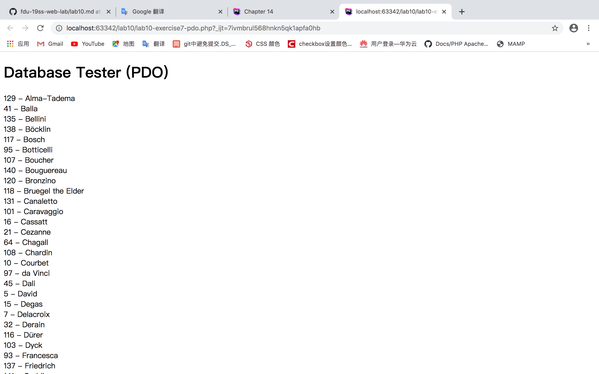

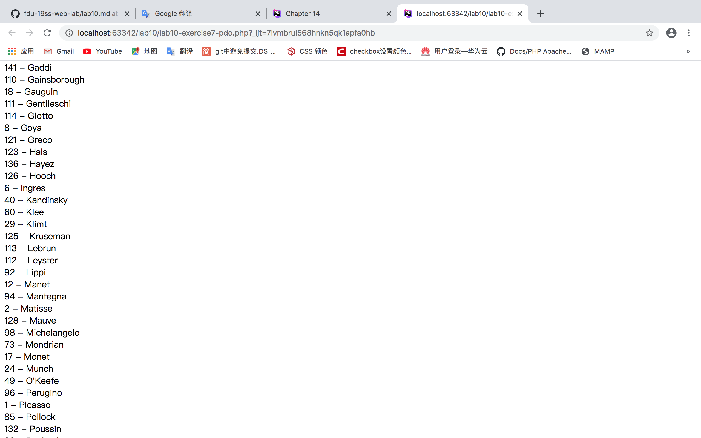

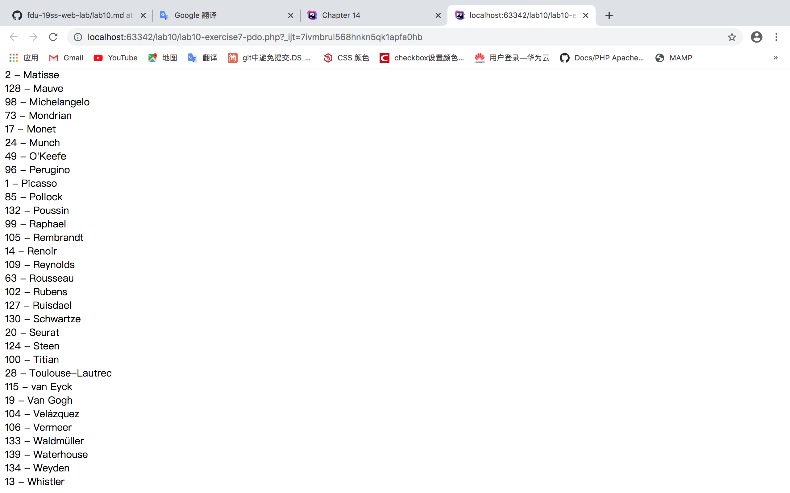

第二种方法：

这里的html文件是动态把数据库中的数据按照一定顺序排列后加到select的选项中

这里不用pdo对象，而是直接用mysqli_connect函数建立数据库连接，如果连接出错mysqli_connect_errno()为true，die停止脚本，如果用php 命令在命令行运行脚本时显示错误信息，否则返回500错误页面。

之后设置sql语句为查询art数据库中Genre表中数据且以GenreName为序排列，然后执行该语句，如果执行成功，把结果加到select选项中，最后释放$result的内存并关闭数据库连接。

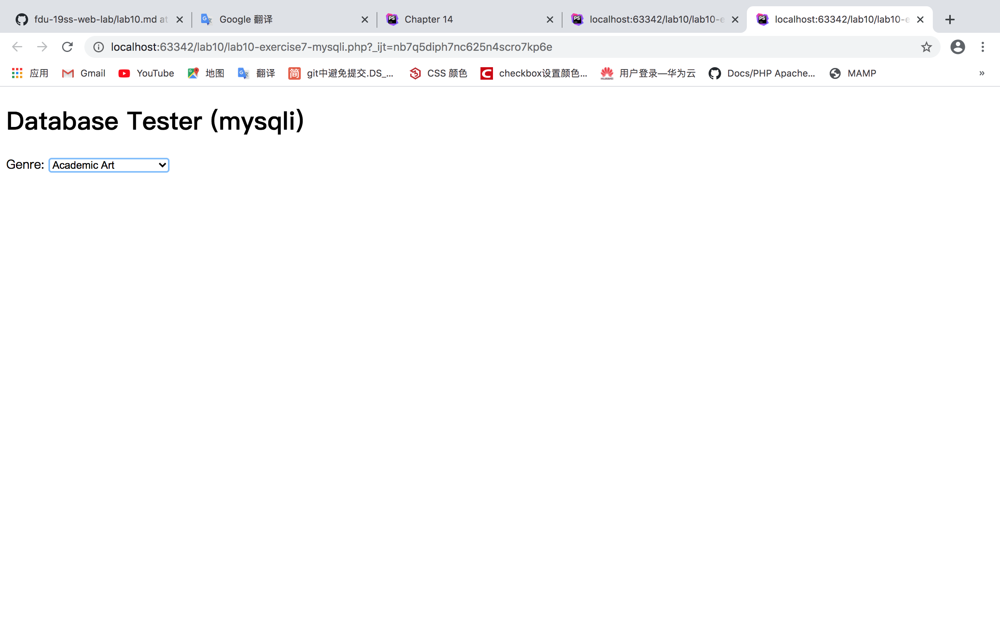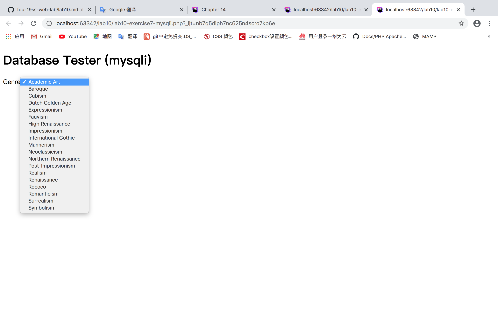

### `lab10-exercise8.php`  screenshots

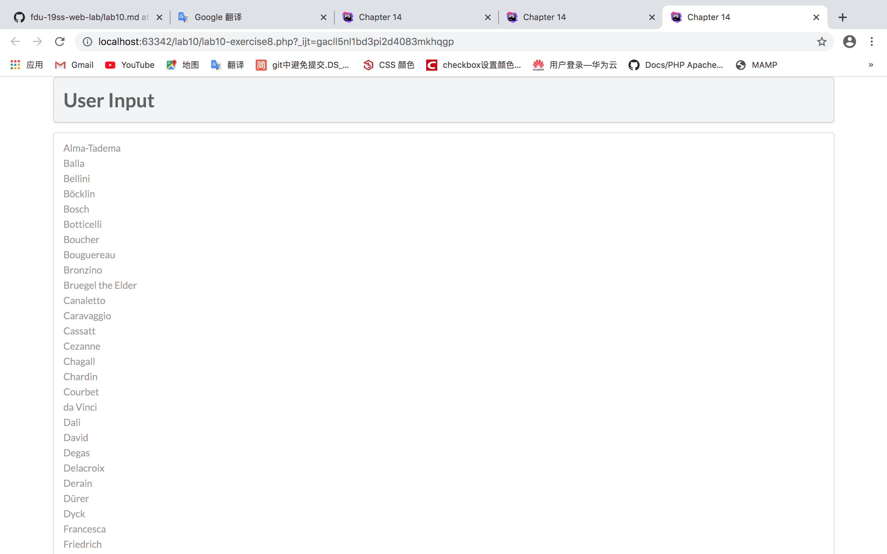


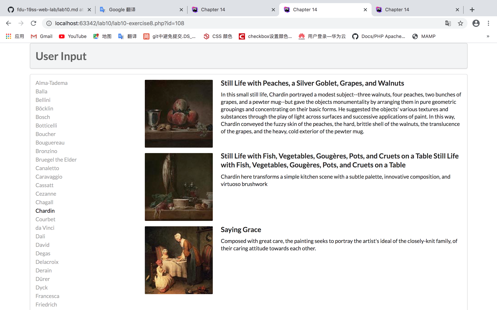

#### function outputArtists()

首先 `$pdo = new PDO(DBCONNSTRING,DBUSER,DBPASS);`  先初始化一个PDO数据对象，PDO对象为php访问数据库定义了轻量级的一致接口，即连接数据库。

`$pdo->setAttribute(PDO::ATTR_ERRMODE, PDO::ERRMODE_EXCEPTION);`这里PDO设置错误码且PDO还将抛出一个PDOException异常类并设置它的属性来反射错误码和错误信息  。

然后sql语句查询Artists表中按照LastName排列的前三十个，把它们包装在一个超链接中并写出条目的LastName（在html对应的位置，因为是在对应的位置调用这个函数的），超链接url取当前相对于网站根目录的路径及 PHP 程序文件名称加上参数为对应的数据的id。

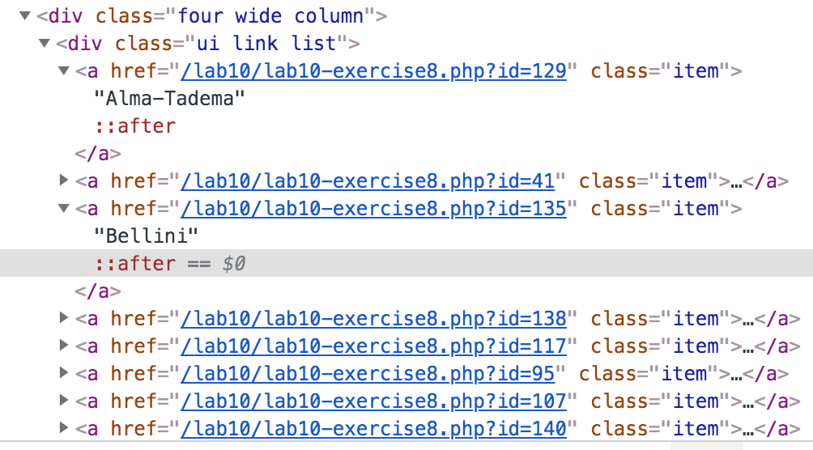

结束后把pdo对象设置为null，还有错误处理机制，如果这当中发生错误题停止脚本，如果用php 命令在命令行运行脚本时会显示错误信息，如果页面会显示500错误页面。

#### function outputPaintings()

当能从页面获得id且id为正常的大于0的正整数即表明为artist id，然后通过pdo对象连接数据库和设置错误码和异常类。然后sql语句通过得到的artistid来查询相应的paintings数据，对于每个查到的数据都调用一次outputSinglePainting($row);打印。

即这里的操作就是把之前点击的画家所画的画都展示出来（在html对应的位置，因为是在对应的位置调用这个函数的）。

结束后把pdo对象设置为null，还有错误处理机制，如果这当中发生错误题停止脚本，如果用php 命令在命令行运行脚本时会显示错误信息，如果页面会显示500错误页面。

#### function outputSinglePainting($row)

对于传入的每一幅画的数据按照一定结构展示，展示出图片，title，和description。

因此这里是用echo写了html代码，通过数据库中的数据，把需要的列中的信息取出，拼成完整的html代码，总而显示为动态生出数据的效果。

结构如下：

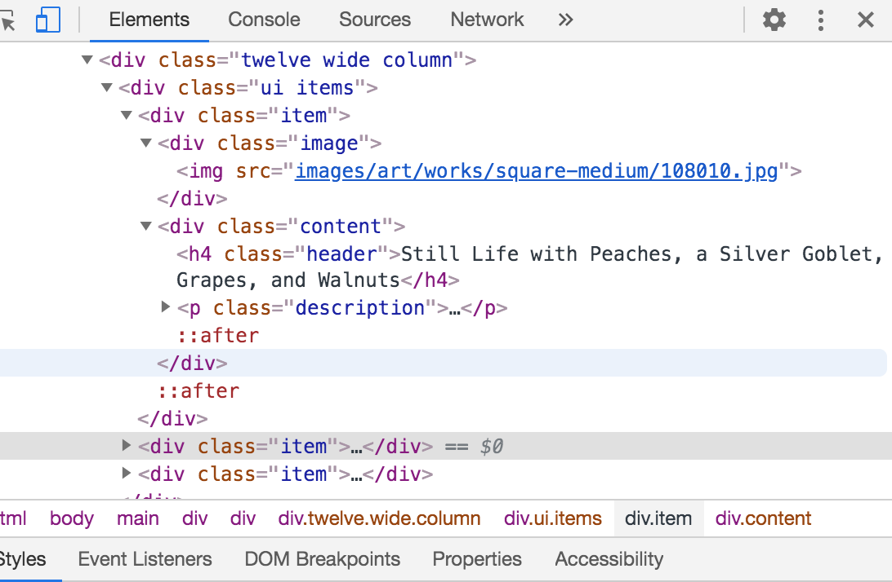


### `lab10-exercise9.php`  screenshots

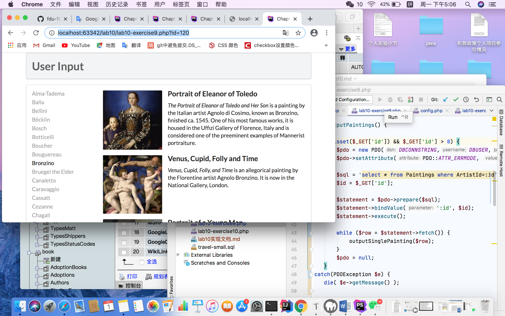


#### summarize  the  way to execute sql code

在PDO中执行sql语句有三种方式：

1、exec()方法

exec()方法返回执行SQL 语句后受影响的行数，其语法格式如下：


参数 satatement 是要执行的SQL语句，该方法返回执行SQL 语句时受影响的行数，通常用于 INSERT，DELETE和UPDATE语句中。

一般这样执行：

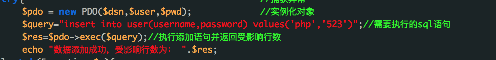

返回：


2、query方法

query()方法用于返回执行查询后的结果集，该函数的语法格式如下如下：


参数 satatement 是要执行的 SQL语句，它返回的是一个PODStatement对象！

一般这样执行：

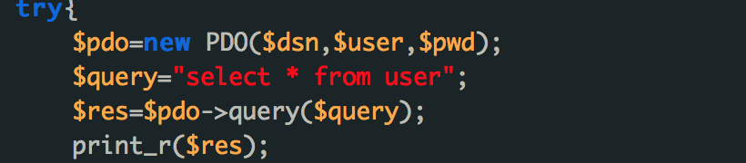

返回：

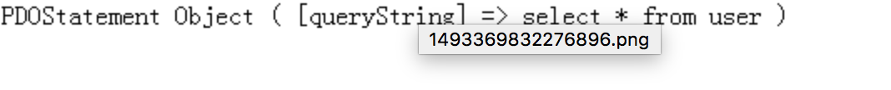

3、预处理语句prepare()和execute()方法

预处理语句包括prepare()和execute()两种方法。首先，通过prepare()方法做查询准备工作，然后通过execute()方法执行查询，并且还可以通过bindParam()方法来绑定参数给execute()方法，语法如下：

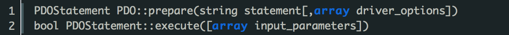

在PDO中通过预处理语句prepare()和execute()执行SQL查询语句，使用循环把数据循环出来。

一般执行如下：

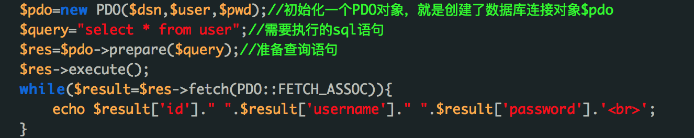


#### the advantage of using Prepared Statements

预处理语句可以看作是想要运行的 SQL 的一种编译过的模板，它可以使用变量参数进行定制。

预处理语句可以带来两大好处： 

a）查询仅需解析（或预处理）一次，但可以用相同或不同的参数执行多次。当查询准备好后，数据库将分析、编译和优化执行该查询的计划。对于复杂的查询，此过程要花费较长的时间，如果需要以不同参数多次重复相同的查询，那么该过程将大大降低应用程序的速度。通过使用预处理语句，可以避免重复分析/编译/优化周期。简言之，预处理语句占用更少的资源，因而运行得更快。 

b）提供给预处理语句的参数不需要用引号括起来，驱动程序会自动处理。如果应用程序只使用预处理语句，可以确保不会发生SQL 注入。（然而，如果查询的其他部分是由未转义的输入来构建的，则仍存在 SQL 注入的风险）。  

即可以这样使用，效率更高：

```php
<?php
$servername = "localhost";
$username = "username";
$password = "password";
$dbname = "myDB";

// 创建连接
$conn = new mysqli($servername, $username, $password, $dbname);

// 检测连接
if ($conn->connect_error) {
  die("Connection failed: " . $conn->connect_error);
}

// prepare and bind
$stmt = $conn->prepare("INSERT INTO MyGuests (firstname, lastname, email) VALUES(?, ?, ?)");
$stmt->bind_param("sss", $firstname, $lastname, $email);

// 设置参数并执行
$firstname = "John";
$lastname = "Doe";
$email = "john@example.com";
$stmt->execute();

$firstname = "Mary";
$lastname = "Moe";
$email = "mary@example.com";
$stmt->execute();

$firstname = "Julie";
$lastname = "Dooley";
$email = "julie@example.com";
$stmt->execute();

echo "New records created successfully";

$stmt->close();
$conn->close();
?>
```

可以直接替换执行，而不用同样类型的sql语句因为不同参数而写多次执行。


