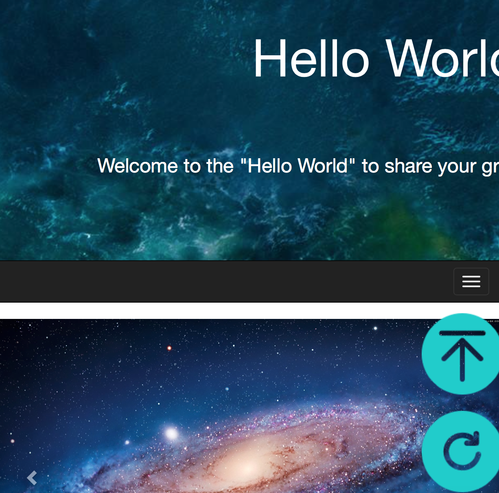
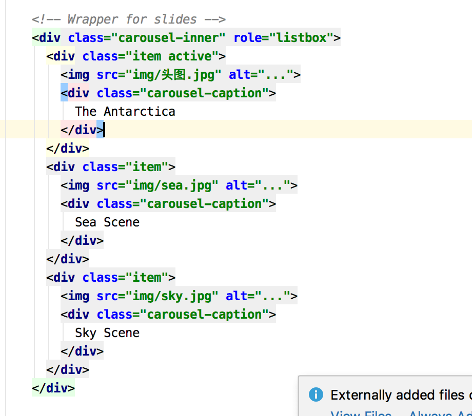
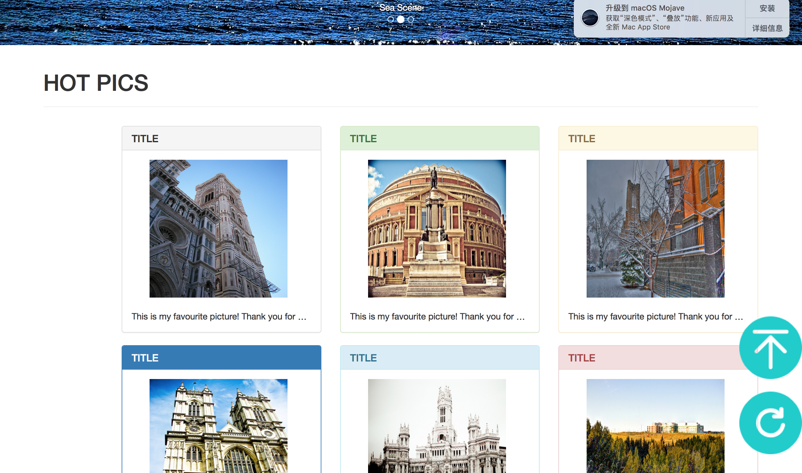
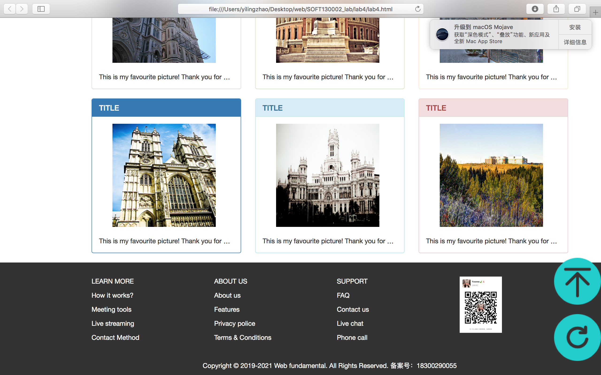

# LAB4 设计文档

####                                                                                                                                                                                                                                    18300290055 赵一玲

## 文档布局介绍

首先我添加了一个header，来进行简要介绍本旅行图片分享的网站“Hello World”，背景设置为一张图片，由于是背景图设计，这里使用的是css，相应的title的简介slogan也均使用css，具体效果如下。


然后是导航栏，用了bootstrap的

```
<div class="navbar-header">
  <button type="button" class="navbar-toggle collapsed" data-toggle="collapse" data-target="#bs-example-navbar-collapse-1" aria-expanded="false">
    <span class="sr-only">Toggle navigation</span>
              <span class="icon-bar"></span>
              <span class="icon-bar"></span>
              <span class="icon-bar"></span>
            </button>
          </div>
 
```

使得当页面缩小/移动端时，会缩放按钮，同时使用`.container-fluid` 容器，从而让导航条居中，并在两侧添加内补（padding）。



真正的导航栏用这个设置。这里遵循我pj1的设计删掉了brand。

```
<div class="collapse navbar-collapse" id="bs-example-navbar-collapse-1">
  <ul class="nav navbar-nav">
    <li class="active"><a href="index.html">Home <span class="sr-only">(current)</span></a></li>
    <li><a href="#">Browse</a></li>
```

接下来是头图的变换，bootstrap的轮播插件 carousel，先设轮播指标（助教已经设好），然后建立轮播项目,代码如下。



最后的效果如下，前一张后一张的设置助教已经为我们实现了这边不多加赘述。


接下来的热门照片展示沿用pj1的要求热门图片6张，这里跟我自己的主页设计不同，用了bootstrap 实现，在bootstrap官方文档上查看模版，然后用chrome的检查来查看具体用法，在这里先用container占格，然后

```
<div class="page-header">
    <h1>HOT PICS</h1>
</div>
```

来设置热门图片的小标题，之后用了如下的框架class来设置图片+图片描述+标题的模块。

```
<div class="row">
    <div class="col-sm-4">
    <div class="panel panel-default">
        <div class="panel-heading">
            <h3 class="panel-title">TITLE</h3>
        </div>
        <div class="panel-body">
            <a href="#"></a>
            <br>
            <br>
            <div style="overflow: hidden;text-overflow: ellipsis;white-space: nowrap;"> This is my favourite picture! Thank you for watching!</div>

        </div>
    </div>
```



然后这里是pj1要求的刷新图片和回到顶部的icon。href设置为锚到Hello World的title这里，刷新为alert。最后是尾注footer，同样是

```
<div class="container">
   <div class="row">
      <div class="col-md-3">
          <p><a>LEARN MORE</a></p>
```

但是用了col-md-3，设置内容基本与我pj1相同，三列官方语言加上网站作者的微信二维码。



综上为我这次lab4的布局，除了header的处理用了css之外，基本以bootstrap实现，这次lab4督促了我对于bootstrap这种的框架进行了简单的学习使用，让我了解了便捷的插件使用功能和布局排版，为下一次的pj2作准备💪


