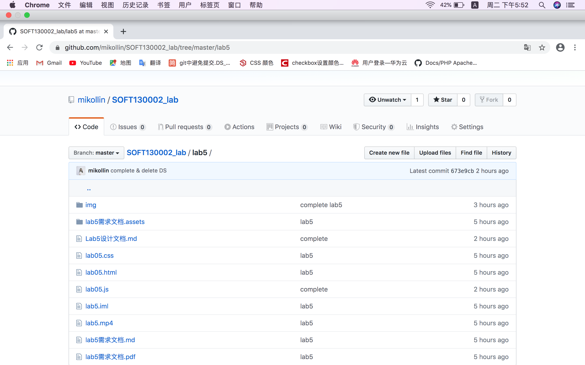

### Lab5设计文档

——18300290055 赵一玲

#### 1、实现情况

##### 1.1 function showWindowHref()

首先设置一个result变量，里面存放的值为最后填充到result文本框中的内容。这里先设置其初始值，即若url不含name参数时打印的内容。同时设置要找的参数名name给queryName。

```
let result="can't find the argument";
```

总体函数的实现为，先读url的value，将其先根据？分割，取？后半段，参数部分。之后先判断后半段是否为undefined，即参数是否存在，如果有参数那么从第0号字符开始，根据&分割，遍历分割后的substrings,对于每一个substring再根据=分割，分割结果赋予pair，易知，其只有两个sub-substrings，找到为name的参数名，最后将对应的参数值给到url_result

```javascript
function showWindowHref(){
    let result="can't find the argument";
    let queryName="name";
    let urlstring=url.value;
    let vars = (urlstring||"").split("?"); //增加未定义(空字符串)的情况
    //solve TypeError: Cannot read property 'split' of undefined
    urlstring=vars[1];//获取url中"?"符后的字串
    if (urlstring!=undefined) { //判断是否有参数
        var str = urlstring.substr(0);
        let vars = str.split("&");
        for (let i = 0; i < vars.length; i++) {
            let pair = vars[i].split("=");
            if (pair[0] == queryName) {
                result=pair[1];  //逐个搜索
            }
        }

    }
    url_result.value=result;
}
```

在这里遇到一个问题，一开始我是直接对url.value进行分解包括关于？的分解和&的分解。然后发现我的内容不能像mp4视屏中那样随着url的更改和新的commit而变化，同时chrome检查会发现报错如下，即我的url当不刷新页面再次click submit按钮是会出现undefined的情况。然后选择建一个变量urlstring，把它初始赋为url.value，之后相关操作都对其进行更改，然后就行了，也不会报错。

```javascript
TypeError: Cannot read property 'split' of undefined
```

##### 1.2 function timeTest()

首先设置mul的初始值为1

然后设置一个计数器i=0；然后设置函数对象setInterval(timeTest,5000)，每隔5s，调用timeTest函数使得数值翻倍，同时计数器+1，当运行了10次后，调用clearInterval()将interval删掉，停止。

这里如何当整分到达时结束，遇到问题，一开始我只是在timeTest中加了

```javascript
if(new Date().getSeconds()==0||i==10) {
        clearInterval(interval);
    }
```

然后就导致要恰好为5的倍数的秒数才能结束，即当调用testTime时的时间正好为整分时才结束。

思考了很久发现可以再用一个setInterval函数来控制，用匿名函数来判断是否整分，若整分结束两个setInterval,每1ms就判断一下

```javascript
let mul = document.getElementById("mul");
mul.value=1;
let i=0;
let interval=setInterval(timeTest,5000);//页面载入后，每经过指定毫秒值后执行指定表达式，是间隔多次执行的
let id =setInterval(function () {
    if (new Date().getSeconds()==0){
           clearInterval(id);
           clearInterval(interval);
    }
},1);

function timeTest(){
    mul.value=mul.value*2;
    i=i+1;
    if(new Date().getSeconds()==0||i==10) {
        clearInterval(interval);
    }

}
```

##### 1.3 function arrSameStr()

首先同1.1中取most.value给mostv，json为一个json空对象，mostv.charAt[i]为第i位的字符，如果json中没有这个字符，则给他一个初始值1，如果有++，之后遍历json找到字符串中出现次数最大的字符，记录此字符并记录次数。

```javascript
function arrSameStr(){

    let mostv=most.value;
    let json = {};
    for (var i = 0; i < mostv.length; i++) {
        if(!json[mostv.charAt(i)]){//这里mostv.charAt(i)分别会输出i位置的字符，json初始化设置为一个空对象。
            json[mostv.charAt(i)] = 1;//给一个初始值
        }else{
            json[mostv.charAt(i)]++;//有初始值后再次出现++
        }
    };
    var iMax = 0;
    var iIndex = '';
    for(var i in json){
        if(json[i]>iMax){
            iMax = json[i];
            iIndex = i;
        }
    }
    result.value='出现次数最多的是:'+iIndex+'出现'+iMax+'次';

}
```


#### 2、需要的截图




