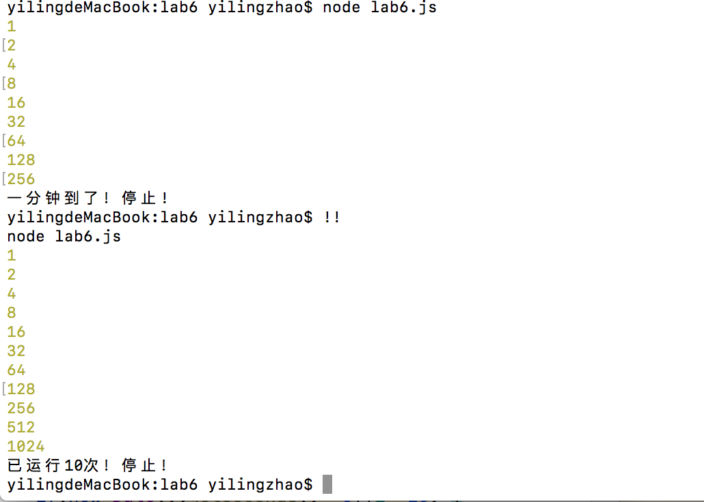

## lab6设计文档

——18300290055 赵一玲

##### Tips

最后我编写并调用函数test来调用每一题的函数看结果，这里因为第一题的时间比较长，放到了最后再调用。

#### 一些截图

github截图：


本地命令行截图：


按照样例的输出版本：


第一题整体的情况如下（为了方便这边直接列出两种情况）：



#### 正则表达式的解释

请看每一题中逐个讲解。

#### Map、Set、Array之间的区别和使用

区别：

Map是映射，其中存放键值对，同一个键多次赋值会覆盖，描述映射，没有sort方法，没有slice方法，有set可添加。

Set中每个成员唯一，所以可以用来过滤重复元素，可以接受数组对象作为参数，通过size属性得知个数，没有sort方法，没有slice方法，有add可添加。

Array是数组，可重复，可与map转换，如Array.from(map)，有length属性得知个数，有其特有的方法：sort，join，slice，push可添加。

具体使用及其使用原因请看每一题中逐个讲解。

#### 继承不同方式的理解

构造函数的继承：在子类构造函数中用call调用父类的构造函数，得到其属性值，再向其子类原型增加方法之后再实例化。但是父类原型中的方法（和属性）对子类不可见，父类实例方法无法被复用。

原型链的继承：将子类的原型设为父类的实例，之后可以增加方法/覆盖父类方法。可以在构造函数中设置子类特有的属性。但其无法在不影响所有子类实例的情况下向父类构造函数传参。

Object.create（）的继承：将一个对象作为另一个对象的基础，适用于让一个对象与另一个对象保持相似的场景，将源对象传入Object.create（），再修改目标对象。将第一个参数设为我要创建的对象的原型，本质上对已有对象做了浅复制，是原型式继承。浅复制后再加上自己的属性和方法。

具体的继承操作看第八题中的详解。

#### 第一题

在testTime（）中建立内部函数，闭包，一个是interval，其中为计算value翻倍的代码，同时每次运行计数，到10次停止，每隔5s运行一次。另一个是stop,每隔1ms查看一次保证一旦到了整分立刻停止,不用管是否是5为倍数的整秒调用。

同时由于这次两个setInterval都是在testTime中的，两个都要清除彼此。

#### 第二题

关于电话号码的正则表达式的理解：

【参考的规则原文链接：http://caibaojian.com/phone-regexp.html】

中国电信手机号码开头数字
2G/3G号段（CDMA2000网络）133、153、180、181、189
4G号段 177

中国联通手机号码开头数字
2G号段（GSM网络）130、131、132、155、156
3G上网卡145
3G号段（WCDMA网络）185、186
4G号段 176、185[1]

中国移动手机号码开头数字
2G号段（GSM网络）有134x（0-8）、135、136、137、138、139、150、151、152、158、159、182、183、184。
3G号段（TD-SCDMA网络）有157、187、188
3G上网卡 147
4G号段 178

从以上我们可以看到第一位是【1】开头，第二位则则有【3,4,5,7,8】，第三位则是【0-9】，第三位之后则是数字【0-9】。从而我们可以得出一个符合当前的手机号码验证正则表达式。

于是我才用的正则表达式如下：

```js
let reTel=/^1(3|4|5|7|8)\d{9}$/;
```

即从开头，第一位1，之后是3/4/5/7/8，之后是\d重复九次，即ascii码数字重复九次。

关于邮箱正则表达式的理解：

邮箱的基本格式为“名称@域名”，需要使用“^”匹配邮箱的开始部分，用“$”匹配邮箱结束部分以保证邮箱前后不能有其他字符。

```js
let reMail=/^[a-zA-Z0-9_-]+@[a-zA-Z0-9_-]+(\.[a-zA-Z0-9_-]+)+$/;
```

邮件名称表达式：`[a-zA-Z0-9_-]+` ,允许0-9数字大小写英文字母-和，之后域名部分可为“`**` `.**` `.**` `.**`”，`**` 部分可以表示`[a-zA-Z0-9_-]+`,`.**`部分即`\.[a-zA-Z0-9-]+`，而多个`.**`可以表示为`\.[a-zA-Z0-9_-]+)+`,综上，域名部分表示为：`[a-zA-Z0-9_-]+(\.[a-zA-Z0-9_-]+)+`

即邮箱表达式的pattern：

`^[a-zA-Z0-9_-]+@[a-zA-Z0-9_-]+(\.[a-zA-Z0-9_-]+)+$`

之后用正则表达式的test方法来判断是否符合要求并打印。

#### 第三题

通过正则表达式找到相邻的重复单词放入一个set

```js
let reg=/\b([a-zA-z]+) \1\b/ig;
```

\b是匹配一个单词的边界, \1是引用第一个括号的内容,即相邻重复的英文单词，中间还应该有空格隔开。最后flag设置全局匹配和匹配过程忽略大小写。

用字符串的match方法把相邻的重复英文单词的结果赋给一个array数组，建立compare函数使得比较单词为首字母排序，即AaBbCc……，如下：

```js
function compare(a,b){//首字母比较
    if((a.toLocaleUpperCase())[0]===(b.toLocaleUpperCase())[0])
        return a-b;//ASCII 从小到大
    else
        return a.localeCompare(b)
}
```

a.localeCompare(b)是按照aabBcC……的顺序，所以加一步判断如果两个字母是相同的（不分大小写），则返回ascii码序，即大写在前小写在后。

把数组重新取排序后前十个，排序完之后通过 `let set=new Set(array);`把数组转为集合，把重复的过滤，如果过滤后集合中元素仍超过十个，则经过一个循环取result为转换后的数组（用`result = array.slice(0, i);`）转换为set一直取到set的size为10为止（因为有可能array中比如有14个结果，但是有两个是重复的，且在前十个中，那么需要保证取到后五个元素加到set中保证其size为10，正确）。最后打印。

#### 第四题

先将wantInput和actualInput，均转换成大写然后每个字符串设置一个计数器，wantInput设置为i，actualInput设置为j，从0开始逐字比较两者，如果相同，双方均++，如果不同，我们知道键盘坏了一定是wantInput的字符多，所以此时先加到set中（由于键盘字母是大写的），wantInput的index：i++，继续比对。最后打印set。

#### 第五题

首先将str字符串按照空格分割到array数组中，然后倒序遍历改数组，如果不为空格则加到result中（用push方法），最后result数组用空格把数组元素链接，并且加上“”。

#### 第六题

先创建一个空数组result，遍历参数数组（一个for循环），进行这一步，将target-nums[i]下标的元素设为当前i：

```js
result[target-nums[i]] = i;
```

之后判断result[nums[i]] 是否为undefined，如果不是，即说明之前出现了i0，与当前i相加为target，将改对映射放入map中,参数数组遍历完成后，用Array.from(map)转换为数组，对其进行排序。同时为了得到样例输出如下设置：

```js
result=result.join(']\n[');

console.log('['+result+']');
```

#### 第七题

首先用一个空字符串result作为当前最长字符串，lens初始值为0。遍历参数字符串，逐字符来看，如果当前字符不在result中，加到result末尾，设置lens：`lens=lens<result.length?result.length:lens;`

如果在result中，则说明有重复，取重复的后一个字符开始重新取包含不同字符的子字符串长度，如果长度小于之前的lens，则不改变，如果更长，则说明找到更长的，改变。

最后打印lens，即最长的不同字符子字符串长度。

#### 第八题

这里原型链、和Object.create的继承方式在构造函数中没有用call 调用父类Country的构造函数，为了与借助构造函数方式的继承区分。（毕竟不是组合继承/寄生组合式继承）

构造函数的继承：在子类构造函数DevelopingCountry中用call调用父类的构造函数，得到其属性值，再向其子类原型增加方法

```js
function DevelopingCountry(){
    Country.call(this);//借助构造函数
}
DevelopingCountry.prototype.sayHi=function(){
   return "Hi,i am a developing country.";
     //console.log()默认接受函数时会打印返回值，如果没有设定，会返回 undefined。
}
```

之后再实例化。这里一开始发现总是会打出一个undefined，之后发现是console.log()默认接受函数时会打印返回值，如果没有设定，会返回 undefined。所以直接返回字符串即可。

原型链的继承：将子类PoorCountry的原型设为父类的实例，之后可以增加方法

```js
function PoorCountry(){
//Country.call(this);
}
PoorCountry.prototype=new Country();  //原型链
PoorCountry.prototype.saySad=function () {
    //console.log("I am a sad poor country.");
    return "I am a sad poor country.";
}
```

之后再实例化

Object.create的继承：

第一种方式（实际采用）：

将第一个参数设为我要创建的对象原型相似的父类原型。之后给子类的原型添加方法。z最后创建实例。

```js
function DevelopedCountry(){
//Country.call(this);
}
   DevelopedCountry.prototype=Object.create(Country.prototype);
   DevelopedCountry.prototype.constructor=DevelopedCountry;
    DevelopedCountry.prototype.sayHappy=function(){
        //console.log("I am a Happy developed country.");
        return "I am a Happy developed country.";
    }
let developedCountry=new DevelopedCountry();

```


第二种方式：

将第一个参数设为我要创建的对象相似的父类对象即Country。之后给子类添加方法。

```js
let developedCountry=Object.create(Country);
   developedCountry.sayHappy=function(){
       //console.log("I am a Happy developed country.");
       return "I am a Happy developed country.";
   }
```


